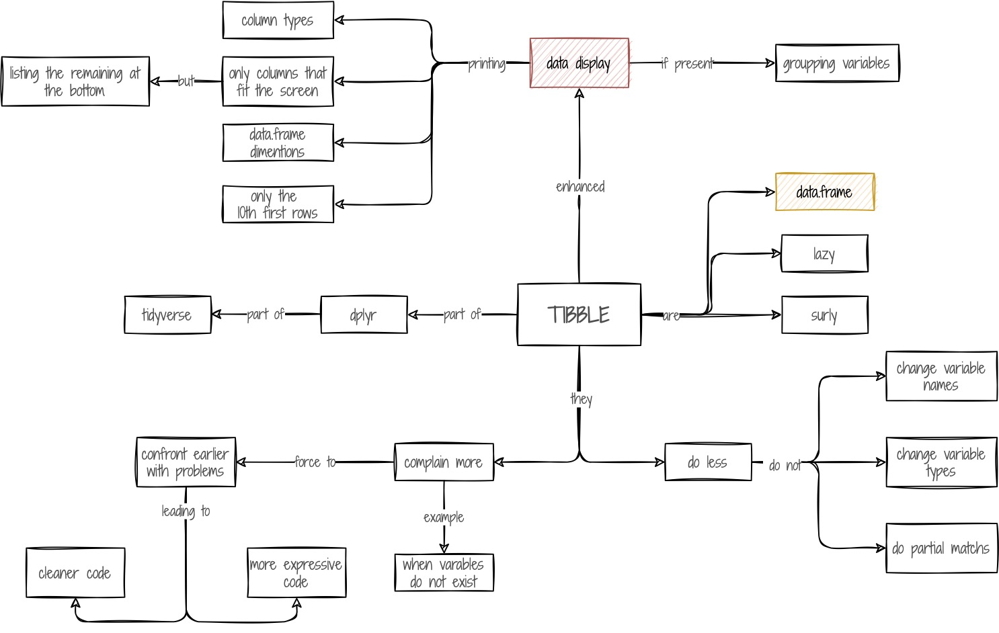

```{r echo = FALSE}
# rmarkdown::render_site("concFond.Rmd")
```

## Obiettivi formativi

1. Operazioni base in R    
1. Concetto di variabile    
1. Concetto di vettore    
1. Concetto di data.frame    
1. Concetto di tibble    

## In caso di necessità

In caso di problemi o domande non esitare a confrontarti con i tuoi colleghi, a scrivere sul canale [Help](https://2021-cnr-r-base.slack.com/archives/C02DE4EB1L4) di Slack o a me in [privato](https://2021-cnr-r-base.slack.com/archives/D027RRHFYSX).

## Formative assessments

Per poter eseguire gli esercizi da RStudio installa il pacchetto "intRo.Esercizi" con i seguenti comandi:    
\> install.packages("devtools")    
\> install.packages("learnr")    
\> library(devtools)
\> install_github("2021-09-CNR-R-base/intRo.Esercizi")    

Formative assessments: l'obiettivo di questi esercizi è darvi la possibilità di capire i vostri progressi. Gli esercizi verranno visti solo da voi e verrà sempre data la possibilità di vedere la corretta soluzione. Non è obbligatorio fare gli esercizi, ma è ovviamente consigliato. 

----

## Operazioni base in R

<iframe width="560" height="315" src="https://www.youtube.com/embed/Y20P3u3c_1c" title="YouTube video player" frameborder="0" allow="accelerometer; autoplay; clipboard-write; encrypted-media; gyroscope; picture-in-picture" allowfullscreen></iframe>

## Concetto di variabile

<iframe width="560" height="315" src="https://www.youtube.com/embed/Y20P3u3c_1c" title="YouTube video player" frameborder="0" allow="accelerometer; autoplay; clipboard-write; encrypted-media; gyroscope; picture-in-picture" allowfullscreen></iframe>

### Variabile concept map

```{r, include=TRUE, fig.align="center", echo=FALSE}

```

<a href=images/variable.pdf>Per scaricare la mappa in pdf, clicca su questo link</a>


## Concetto di vettore
<iframe width="560" height="315" src="https://www.youtube.com/embed/Y20P3u3c_1c" title="YouTube video player" frameborder="0" allow="accelerometer; autoplay; clipboard-write; encrypted-media; gyroscope; picture-in-picture" allowfullscreen></iframe>

### Vettore concept map

```{r, include=TRUE, fig.align="center", echo=FALSE}

```

<a href=images/vector.pdf>Per scaricare la mappa in pdf, clicca su questo link</a>

## Concetto di data.frame    

<iframe width="560" height="315" src="https://www.youtube.com/embed/Y20P3u3c_1c" title="YouTube video player" frameborder="0" allow="accelerometer; autoplay; clipboard-write; encrypted-media; gyroscope; picture-in-picture" allowfullscreen></iframe>

### data.frame concept map

```{r, include=TRUE, fig.align="center", echo=FALSE}

```

<a href=images/Dataframe.pdf>Per scaricare la mappa in pdf, clicca su questo link</a>

## Concetto di tibble    

<iframe width="560" height="315" src="https://www.youtube.com/embed/Y20P3u3c_1c" title="YouTube video player" frameborder="0" allow="accelerometer; autoplay; clipboard-write; encrypted-media; gyroscope; picture-in-picture" allowfullscreen></iframe>

### Tibble concept map

```{r, include=TRUE, fig.align="center", echo=FALSE}

```

<a href=images/tibble.pdf>Per scaricare la mappa in pdf, clicca su questo link</a>

----

## Summative assessment

Da RStudio installa il pacchetto "intRo.Esercizi" con i seguenti comandi:    
\> install.packages("devtools")    
\> install.packages("learnr")    
\> devtools::install_github("2021-09-CNR-R-base/intRo.Esercizi")    
\> learnr::run_tutorial("lezione_02", package = "intRo.Esercizi")

Esegui tutti gli esercizi e sottometti i risultati come spiegato nell'ultima pagina del test.

