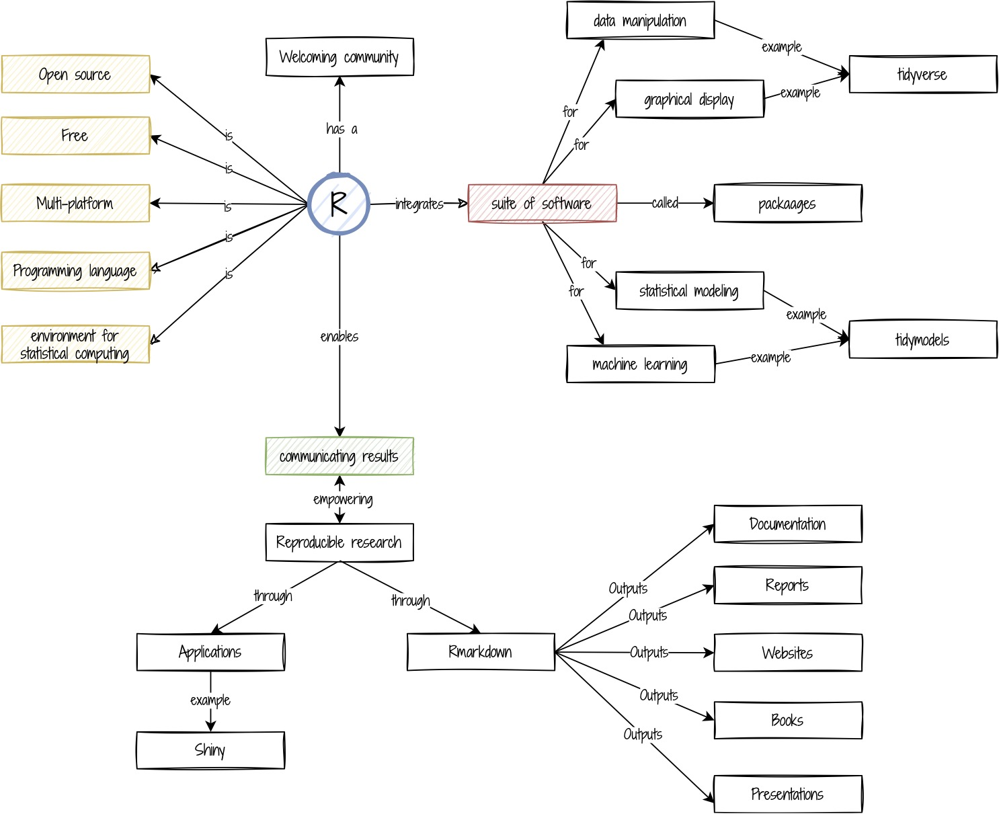

## Obiettivi formativi

1. Cos'è R

1. Quali sono le potenzialità di R

1. Cos'è RStudio e perchè usarlo

1. Come funziona RStudio

## In caso di necessità

In caso di problemi o domande non esitare a confrontarti con i tuoi colleghi, a scrivere sul canale [Help](https://2021-cnr-r-base.slack.com/archives/C02DE4EB1L4) di Slack o a me in [privato](https://2021-cnr-r-base.slack.com/archives/D027RRHFYSX).

----

```{r echo = FALSE}
# rmarkdown::render_site("rSconos.Rmd")
```

## Cos'è R

<iframe width="918" height="574" src="https://www.youtube.com/embed/iqGTw4TeIc8" title="YouTube video player" frameborder="0" allow="accelerometer; autoplay; clipboard-write; encrypted-media; gyroscope; picture-in-picture" allowfullscreen></iframe>

### R concept map

```{r, include=TRUE, fig.align="center", echo=FALSE}

```

<a href=images/R.pdf>Per scaricare la mappa in pdf, clicca su questo link</a>

## Quali sono le potenzialità di R

<iframe width="560" height="315" src="https://www.youtube.com/embed/IeBJ5B-1FXA" title="YouTube video player" frameborder="0" allow="accelerometer; autoplay; clipboard-write; encrypted-media; gyroscope; picture-in-picture" allowfullscreen></iframe>

## Cos'è RStudio e come funziona

<iframe width="560" height="315" src="https://www.youtube.com/embed/4rUHmIzTt8g" title="YouTube video player" frameborder="0" allow="accelerometer; autoplay; clipboard-write; encrypted-media; gyroscope; picture-in-picture" allowfullscreen></iframe>


## Formative assessments

<iframe width="560" height="315" src="https://www.youtube.com/embed/6jKCV4bxDcE" title="YouTube video player" frameborder="0" allow="accelerometer; autoplay; clipboard-write; encrypted-media; gyroscope; picture-in-picture" allowfullscreen></iframe>


## Risorse utili

- [CRAN](https://cran.r-project.org/)    
- [Bioconductor](http://www.bioconductor.org/)    
- [Come scrivere un esempio riproducibile](https://reprex.tidyverse.org/articles/reprex-dos-and-donts.html)     
- [Rmarkdown](https://rmarkdown.rstudio.com/)

----

# [Feedbacks](https://forms.gle/8FtjvxkqY4ijJtf7A)
