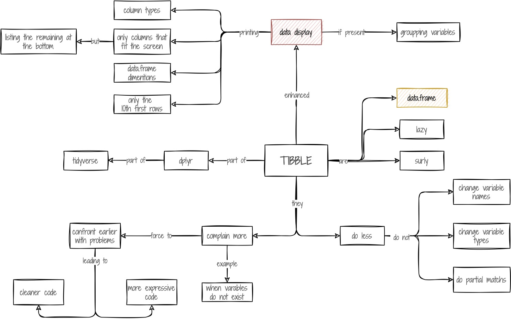

```{r echo = FALSE}
# rmarkdown::render_site("wrangle.Rmd")
```

## Obiettivi formativi

1. Descrizione del metapacchetto tidyverse    
1. Descrizione e utilizzo delle 5 funzioni principali di dplyr     
    - Select    
    - Filter     
    - Mutate     
    - group_by    
    - Summarise    
1. Descrizione e utilizzo delle funzioni pivot_longer e pivot_wider del pacchetto tidyr     
1. Esportazione dei dati     

## In caso di necessità

In caso di problemi o domande non esitare a confrontarti con i tuoi colleghi, a scrivere sul canale [Help](https://2021-cnr-r-base.slack.com/archives/C02DE4EB1L4) di Slack o a me in [privato](https://2021-cnr-r-base.slack.com/archives/D027RRHFYSX).

## Formative assessments

Per poter eseguire gli esercizi da RStudio installa il pacchetto "intRo.Esercizi" con i seguenti comandi:    
\> install.packages("devtools")    
\> install.packages("learnr")    
\> library(devtools)    
\> install_github("2021-09-CNR-R-base/intRo.Esercizi")    
\> learnr::run_tutorial("lezione_01", "intRo.Esercizi")

Formative assessments: l'obiettivo di questi esercizi è darvi la possibilità di capire i vostri progressi. Gli esercizi verranno visti solo da voi e verrà sempre data la possibilità di vedere la corretta soluzione. Non è obbligatorio fare gli esercizi, ma è ovviamente consigliato. 

----


## Manipolazione dei dati

### Parte I - Introduzione

<iframe width="560" height="315" src="https://www.youtube.com/embed/pdcbAExpovw" title="YouTube video player" frameborder="0" allow="accelerometer; autoplay; clipboard-write; encrypted-media; gyroscope; picture-in-picture" allowfullscreen></iframe>

### Parte II - Select

<iframe width="560" height="315" src="https://www.youtube.com/embed/Y3wZeVFx6nw" title="YouTube video player" frameborder="0" allow="accelerometer; autoplay; clipboard-write; encrypted-media; gyroscope; picture-in-picture" allowfullscreen></iframe>

### Parte III - Filter

<iframe width="560" height="315" src="https://www.youtube.com/embed/3T5uM9BnAqY" title="YouTube video player" frameborder="0" allow="accelerometer; autoplay; clipboard-write; encrypted-media; gyroscope; picture-in-picture" allowfullscreen></iframe>

### Parte IV - Pipe operator

<iframe width="560" height="315" src="https://www.youtube.com/embed/oTVxiVWB3r8" title="YouTube video player" frameborder="0" allow="accelerometer; autoplay; clipboard-write; encrypted-media; gyroscope; picture-in-picture" allowfullscreen></iframe>

### Parte V - Mutate

<iframe width="560" height="315" src="https://www.youtube.com/embed/KaPfA5GmUwU" title="YouTube video player" frameborder="0" allow="accelerometer; autoplay; clipboard-write; encrypted-media; gyroscope; picture-in-picture" allowfullscreen></iframe>

### Parte VI - group_by e Summarise

<iframe width="560" height="315" src="https://www.youtube.com/embed/W78cbpW1Fsg" title="YouTube video player" frameborder="0" allow="accelerometer; autoplay; clipboard-write; encrypted-media; gyroscope; picture-in-picture" allowfullscreen></iframe>

### Parte VII - pivot_longer e pivot_wider


### Parte VIII - Salvare i dati

- csv/excel
- rds

### Tibble concept map

```{r, include=TRUE, fig.align="center", echo=FALSE}

```

<a href=images/tibble.pdf>Per scaricare la mappa in pdf, clicca su questo link</a>


### Concept maps

- [dplyr](https://github.com/rstudio/concept-maps#dplyr)    
- [select](https://github.com/rstudio/concept-maps#select)    
- [filter](https://github.com/rstudio/concept-maps#filter)    
- [mutate](https://github.com/rstudio/concept-maps#mutate)    
- [group_by, summarize](https://github.com/rstudio/concept-maps#group_by-and-summarize)    
- [pivoting](https://github.com/rstudio/concept-maps#pivoting)    

### Risorse addizionali

- [Tibble in tidyverse](https://tibble.tidyverse.org/)     
- [Tibble in CRAN](https://cran.r-project.org/web/packages/tibble/vignettes/tibble.html)    
- [Tibble in r4ds](https://r4ds.had.co.nz/tibbles.html)    
- [Cheatsheets](https://www.rstudio.com/resources/cheatsheets/)     
- [Tidyverse](https://www.tidyverse.org/)    
- [Tidy data paper](https://vita.had.co.nz/papers/tidy-data.pdf)    


